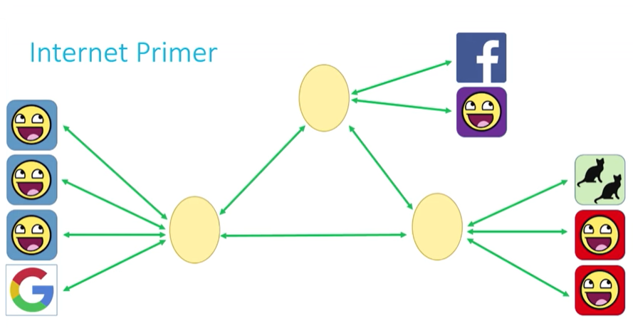
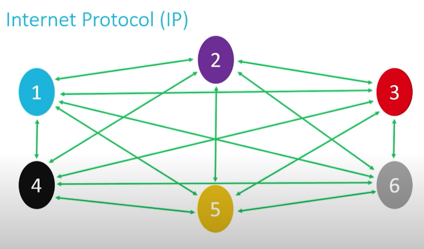
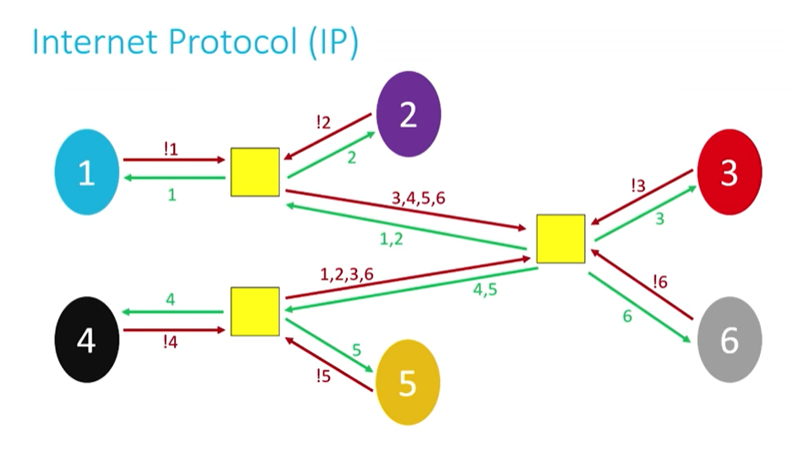
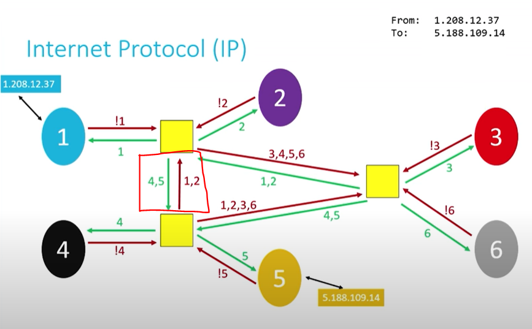
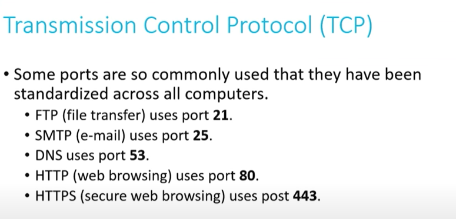
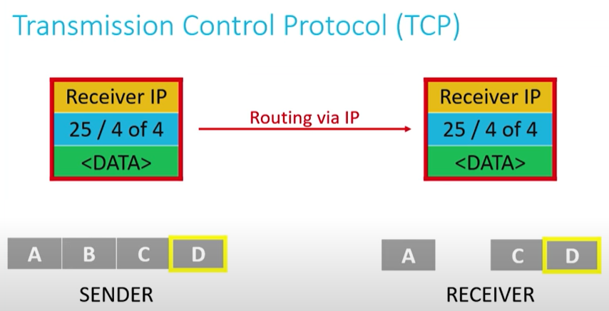

#  Netwhat

- [Netwhat](#netwhat)
  - [**Sources**](#sources)
  - [**Overview of the Internet (Things that exist between us and the internet)**](#overview-of-the-internet-things-that-exist-between-us-and-the-internet)
    - [<ins>IP (Internet protocol) address / Addressing scheme</ins>](#insip-internet-protocol-address--addressing-schemeins)
    - [<ins>DHCP (Dynamic Host Configuration Protocol) Servers</ins>](#insdhcp-dynamic-host-configuration-protocol-serversins)
    - [<ins>DNS (Domain Name System) Servers</ins>](#insdns-domain-name-system-serversins)
    - [<ins>Acess points</ins>](#insacess-pointsins)
    - [<ins>Us and the internet</ins>](#insus-and-the-internetins)
    - [<ins>What is the internet?</ins>](#inswhat-is-the-internetins)
  - [**IP (Internet Protocol)**](#ip-internet-protocol)
    - [<ins>Continuation from earlier</ins>](#inscontinuation-from-earlierins)
    - [<ins>Practical/Modern implmentation</ins>](#inspracticalmodern-implmentationins)
    - [<ins>Efficiency</ins>](#insefficiencyins)
    - [<ins>Breaking down information</ins>](#insbreaking-down-informationins)
    - [<ins>Responsiveness of routers</ins>](#insresponsiveness-of-routersins)
    - [<ins>Routing table</ins>](#insrouting-tableins)
    - [<ins>Summary</ins>](#inssummaryins)
  - [**TCP (Transmission Control Protocol)**](#tcp-transmission-control-protocol)
    - [<ins>Overview & follow up from IP</ins>](#insoverview--follow-up-from-ipins)
    - [<ins>Characteristics of TCP</ins>](#inscharacteristics-of-tcpins)
    - [<ins>TCP/IP Process</ins>](#instcpip-processins)
    - [<ins>If packet is 'dropped'</ins>](#insif-packet-is-droppedins)

## **Sources**
- [CS50 Internet Primer](https://www.youtube.com/watch?v=04GztBlVo_s)
- [CS50 IP](https://www.youtube.com/watch?v=A1g9SokDJSU&t=54s)
- [CS50 TCP](https://www.youtube.com/watch?v=GP7uvI_6uas)

## **Overview of the Internet (Things that exist between us and the internet)**
### <ins>IP (Internet protocol) address / Addressing scheme</ins>
- Address which machine has to uniquely identify itself on the Internet, in order to send out and receive information from correct location.
- Initial scheme - uniquely allocate 32-bit address to each device hoping to connect to internet.
- 32-bit addresses are represented as four clusters of 8-bits using decimal notation
  - w.x.y.z - each can be nonnegative value in range from [0 to 255]
  - e.g. 123.45.67.81 (each of these is in 8 bits, i.e. to 255)
- Roughly 4 billion addresses only (for 7 billion people where each individual may have more than one device anyway).
  - Old scheme (IPv4) has been phasing out and is being replaced with newer scheme (IPv6), which assigns 128-bit addresses instead of 32 bit ones.
  - IPv6 - 8 clusters of 16 bits (represented by hexadecimal) in range [0 to ffff]
  - Google's - 2001:4860:4860:0:0:0:0:8844 > may be represented by 2001:4860:4860::8844 (everything we don't see is assumed to be filled with 0s)

### <ins>DHCP (Dynamic Host Configuration Protocol) Servers</ins>
- Automated program that runs between us and the internet which have a bank of addresses to give out to us when we connect to the internet 
- Basically a DHCP server assigns an IP address to us automatically
- Prior to DHCP, an actual person (sys admin) would manually assign an IP address

### <ins>DNS (Domain Name System) Servers</ins>
 -  We woulnd't usually visit a website by entering its IP address
 -  DNS translates IP addresses (set numbers) to more memorable and comprehensible names.
 -  DNS is somewhat like 'yellow pages' of the web - a huge list storing names from 0.0.0.0 to 255.255.255.255 for IPv4
 -  Just like there's no 1 yellow pages of the world, there's no 1 DNS for the world. Instead there are small scale DNSs everywhere and there are services which aggregate them together, i.e. DNS is decentralised.
  
### <ins>Acess points</ins>
- Modern home networks - routers, modem, switches, etc combine together into a single device.
- Modern business networks or large-scale wide-area-networks (WANs) still have these (routers, modems, switches) to allow size of their network to scale more easily.
- How we've been dealing with IPv4 addressing problem is to assign multiple people to same IP address
- IP address is assigned to a router, which acts as a traffic cop that allows data requests from all devices on our local network (home, business) to be processed through a single IP address.
- Each device connecting through the router would have its own individual private IP address
  
### <ins>Us and the internet</ins>
- In between
  - DHCP servers
  - DNS servers
  - Access points

### <ins>What is the internet?</ins>
- At home/work, we have local, small networks > these networks are woven together to create a large, interconnected network, i.e. Internet.
- Picture each of these small networks being isolated communities with only a single road in or out
- The internet is not an 'ethereal' thing, its a set of rules/protocols which defines how each local network interconnect/communicate with each other.

    

## **IP (Internet Protocol)**
### <ins>Continuation from earlier</ins>
- How do networks know how to communicate with each other? It's the responsiblity of the IP.
- On a large scale, networks are connected via wires (telephone wires, fibre optic wires). Wireless may only work if the network is small.
- When visualising using 6 networks, we may result in alot of wiring. We can't afford connecting all networks with one another.

### <ins>Practical/Modern implmentation</ins>
- Modern internet would obviously consist more than 6 networks, so a more practical solution is required for each network to talk to each other (or we would end up with pieces of networks unable to talk to one another).

  

- This is where routers come into play, where each network is connected to a limited amount of routers (of which are connected to other nearby routers), and each router has instructions on how to move information towards its destination.

  

- This 'information' might be stored in a routing table, inside the router. I.e. if we see an IP address of 4 we go left, if we see 6, we go another way. Basically the problem of 'routing information' is decentralised to multiple routers.

### <ins>Efficiency</ins>
- Basically based on trade-off between speed (traversing through the connected networks and cost of wires)
- Networks are not directly connected to each other, rely on routers to distribute information. On small scale, this may be more inefficient, but on a large-scale, this can dramatically reduce the cost of network infrastructure.

### <ins>Breaking down information</ins>
- Sending data across networks is costy
- Sending large amounts of information can cost a slowdown (imagine a truck on the road instead of a number of small cars). Slowdowns may cause a ripple effect that may throttle the network for all other users.
- So sending data/information (e.g. email, file transfer, web browser request) isn't being sent as one huge block, but instead, in broken down forms (i.e. packets).
- When information is 'dropped' during transmission, splitting information to packets would avoid high cost of re-sending the large data. We just only need to re-send the 'packet'

### <ins>Responsiveness of routers</ins>
- IP also known as a 'connectionless protocol', i.e. not necessarily defined path between sender and receiver.
- There may be multiple routes to our destination. So in response to traffic that may be 'clogging', packets may be re-routed around the traffic jam to follow most optimal path, based on current state of the network.

  

- A side effect of being 'connectionless' is delivery cannot be guaranteed, since path between sender and receiver may not be consistent. What would happen if packets are dropped? (refer to TCP below)

### <ins>Routing table</ins>
- Consists of information for:
  - where do i send this packet from here?
  - what is the cost of using this particular route? (general pulse/state of network)

### <ins>Summary</ins>
- This is basically what IP is, routers would 'generally know' how to send it, and it would send information 1 step closer until it reaches the destination
- IP also breaks down data into packets

## **TCP (Transmission Control Protocol)**
### <ins>Overview & follow up from IP</ins>
- (IP) Just merely relaying information from a 'sending machine' to 'receiving machine' is not sufficient
- TCP can be thought as directing the transmitted packet to the correct program on the receiving machine
- TCP/IP is usually named in conjunction because, it is both important to:
  - identify where the receiver is (IP)
  - identify what program the packet is for (TCP)

### <ins>Characteristics of TCP</ins>
- Port number
  - How specific program/utility/service is identified on a machine - Port number
  - IP + Port number = we can uniquely identify a particular program/utility/service running on a machine

  

- Guaranteeing delivery of packets (which IP alone does not do)
  - TCP includes information about (i) how many packets, (ii) in what order, alongside data being transmitted through the network
  - This is important because IP is a connectionless protocol, so packets can take different paths, and may reach the receiver in a disordered fashion

### <ins>TCP/IP Process</ins>
- When program sends data
  - TCP breaks into smaller chunks of information
  - Communicates the packets to computer's network software, and wraps:
  - information around it (i.e. what port to go to, what order the packets are)
- IP then wraps another layer of info, i.e. where the info is supposed to go
- When destination computer receives packet (using IP information wrapped)
  - Looks at TCP information, and looks at port num and packet order
  - Once receives all of the packets, prepare data to be organised and sends it over to the program/service, e.g. once organised, information routed to port 25 will be interpreted as an email.

  

### <ins>If packet is 'dropped'</ins>
- Receiver computer would detect that not all packets are received
- Obtains sender IP address (from the IP layer/ headers), and requests the packet from the sender
- Sender resends that single packet (instead of everything)