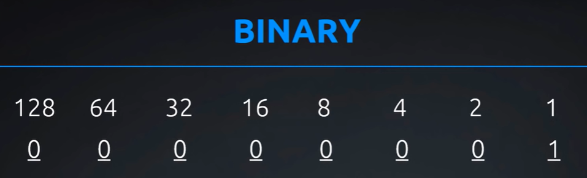

# Subnet
- [Subnet](#subnet)
  - [Videos](#videos)
  - [Binary and IP](#binary-and-ip)
  - [Network IDs and Subnet masks](#network-ids-and-subnet-masks)
    - [Overview](#overview)
    - [Things to know](#things-to-know)
    - [Broadcast network & hosts](#broadcast-network--hosts)
  - [Class System](#class-system)
    - [IPv4 classes](#ipv4-classes)
    - [Loopback addresses](#loopback-addresses)
    - [Question](#question)
    - [Other video](#other-video)

## Videos
- [Part 1 - Binary and IP](https://www.youtube.com/watch?v=ddM9AcreVqY)
- [Part 2 - Network IDs and Subnet Masks](https://www.youtube.com/watch?v=XQ3T14SIlV4)
- [Part 3 - Classes](https://www.youtube.com/watch?v=4xlzlgYGqW8)

## Binary and IP
- Binary 1s and 0s can be seen as 'switches'
- Octet is a group of 8 binary digits.
- IP is made up of a total of 32 binary digits that are broken to 4 octets (of 8 bits each)
- Stores (in decimal) - 0 (all switches off) to 255 (all switches on)

- To link over to subnetting lesson (over broadcasting address)
  - If all of the 'switches' after a single one is switched on, e.g. only 128 is swithed off but the rest is on, the total will always be 1 less, i.e. 127 in this instance (128 - 1)
  

## Network IDs and Subnet masks
### Overview
- Network ID (IP address coupled with CIDR [Classless Inter-Domain Routing] notation)
  - E.g. 192.168.1.0 / 24
  - 24 equals number of bits turned on in subnet mask
  - So, subnet mask = 255:255:255:0, because we know the last 8 is turned 0
- Terminologies
  - IP Address
  - Netmask, can be displayed in
    - Subnet ID - decimal notation - e.g. 255:255:255:0
    - CIDR notation, i.e. length of the subnet mask - e.g. /24
  - Network ID/prefix
    - [Network mask in octet prefix][CIDR notation]
- Other terminologies
  - Wildcard - inverse of netmask

### Things to know
- Converting binary to decimal, e.g. 11111111 > 255, 00000001 > 1
- Converting Mask in octet to CIDR notation (number from 1 to 32) and vice versa
- Finding out network ID from Mask/CIDR
- ??? - Distinction between subnet ID and host ID?

### Broadcast network & hosts
- Broadcast network
  - Number of broadcasts for the network - (add all after the end of the subnet ID)
  - Broadcast address - If something is sent to this address, it will go out to everybody in the network
    - max out 255 for the Network ID where the octets are not yet 'fixed' (keep in mind if CIDR is not divisible by 8)
- Hosts
  - First host address - in example YT7 - 192.168.45.63, i.e. the last octet would be 00111111
  - How many usable IP addresses can we have, subtract 1 to exclude broadcast address
  - Usually the first host address is used for the modem, so usuable IP addresses = 1 less again
- Useful links
  - [Subnet mask calculator](http://www.aboutmyip.com/AboutMyXApp/SubnetCalculator.jsp)
  
  

  - [Explanation over broadcast address](https://en.wikipedia.org/wiki/Broadcast_address)

  

## Class System
### IPv4 classes
- IP classes provide a default mask based on number in the first octet
- This system was set up "before" IPv4 was implemented, It was realised that there weren't enough range

### Loopback addresses
- pinging myself?
  - e.g. in command prompt, we can enter "ping 127.0.0.1", and receive a reply
  - we cannot enter "127.255.255.255" because this is a broadcast range?
- All addresses with 127 in the first octet is taken by this loopback range
- Class D Multicasting - used alot in networking/ streaming?
- Class E Experimental - research?
- 255.255.255.255 is not in any classes, because this is the broadcasting IP

### Question
- Why do we still need classes? They seem outdated

### Other video
- IPv4
  - Broken down into 5 classes (A, B, C, D, E)
    - A, B, C - Public/Private IP addresses
      - Public IP address - what we see on the internet, whenever we want to connect to the internet, we need a public IP address
      - Private - What we use for our internal/home/corporate network
      - Class that concern us the most
    - D - Multicasting
      - Used in conference calls
      - IP address designed to bring group of people together all at once
    - E - Government & research
  - 32-bits long (with 4 8-bit-segments called octets)

- IP addresses vs phone numbers
  - splitting of IP address into:
    - network IDs, and
    - host/node IDs
  - relating this to use of area codes in telephone numbers

- Classes of IP addresses
  - Recognise class of IP address
    - What's the point of having classes?
    - When IP address scheme was invented in 70s, individual persons(s) were never supposed to have access to the 'internet' (which was the ARPANET). Government, business and schools were the only entities 'supposed' to use the ARPANET network.
      - Class A (more IP addresses) - largest governments/schools/entities in the world
        - 1st octet - 1 - 126
      - Class B - 'medium' sized entities
        - 1st octet - 128 - 191
      - Class C (lesser IP addresses) - small
        - 1st octet - 192 - 223
      - Random
        - 127 - in essense talks to myself
          - 127.0.0.1 - local loopback address
          - Why would i want to talk (ping) to myself? for troubleshooting
    - In real life, there is alot of wastage of IP addresses
  - Breaking down to (i) network ID & (ii) host/node ID portions of IP address
    - Think of network ID as 'area codes' in phone lines
    - Class A - network ID (1st octet)
    - Class B - network ID (1-2 octet)
    - Class C - network ID (1-3 octet)

- Public/Private IP addresses
  - Overview
    - When 'on the internet', we must be connected through a public IP address (which is a unique number in the world)
    - Private IP - not on the internet, set up as part of home/corporate network
    - Individuals were not meant to be on the 'internet'. On 1992, it was opened up to the internet
    - Per IPv4, there are only a limited amount of IP addresses for everybody, i.e. 4 billion.
  - Relationship between public and private IP addresses
    - Private IP addresses are used to gain access to a public IP address
    - Using routers, somewhere in the network connects our private networks to the public network. We are not 'on the internet', but we 'have access' to the internet.
  - Private IP address
    - 3 classes
      - Class A - 10.0.0.0 - 10.255.255.255
      - Class B - 172.16.0.0 - 172.31.255.255
      - Class C - 192.168.0.0 - 192.168.255.255
    - All IPs other than the ones mentioned above are public?
      - How does this work?
- Subnet masks
  - If somebody just gives us an IP address, we actually just received half of the information we need... cannnot do much with this information alone
  - Standard masks (according to classes A, B, C)
    - 255 = network IDs
    - 0s for node IDs
    - A - 255.0.0.0
    - B - 255.255.0.0
    - C - 255.255.255.0

Useful links
https://www.paessler.com/support/it-knowledge/it-explained/ip-address

